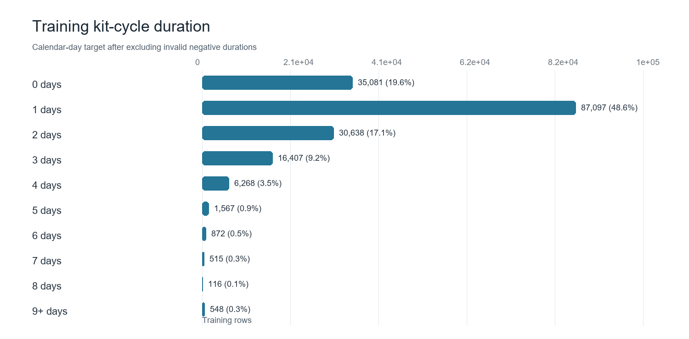
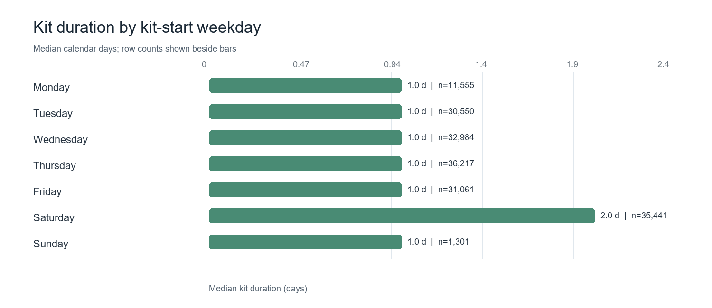
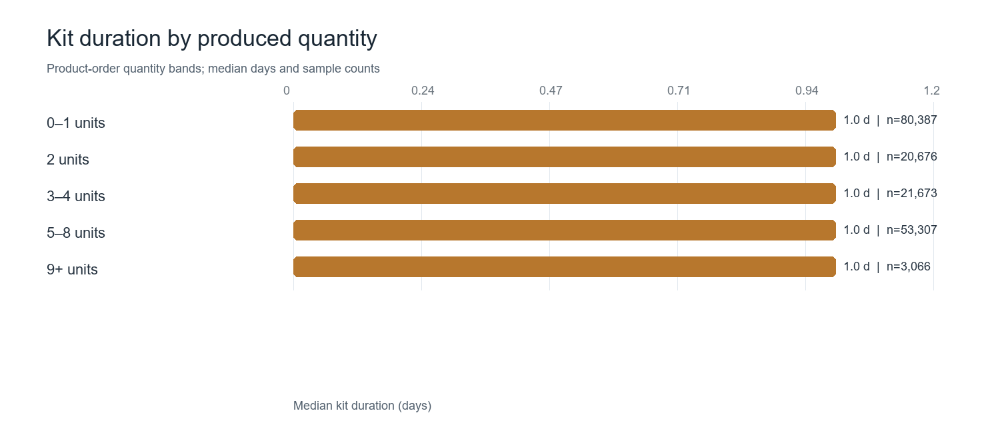
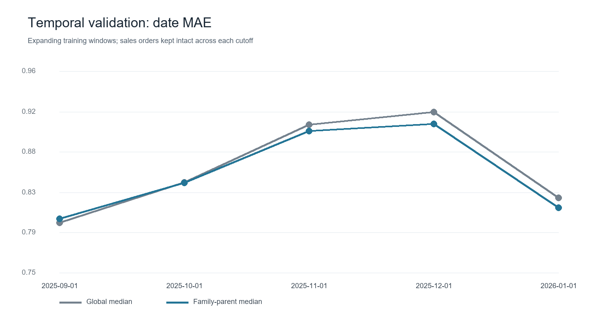

# Shivya Sharma — KIT End Date Prediction

## Executive summary

I predict the kit completion date from the observed `kit_start` date. For each order-family row, the selected model uses the historical median elapsed calendar days for `family_parent_desc`, rounded to a nonnegative whole day; unseen parents fall back to the global median. I then add this duration to `kit_start`. The sales-order completion date is the latest predicted family completion date within the order.

The selected model improves mean absolute error (MAE) modestly over the global-median benchmark on the main time-based holdout: 0.898 vs. 0.904 days per order-family row and 0.894 vs. 0.902 days per sales order. It improves within-one-day accuracy, but exact-day accuracy is slightly lower. A feature-rich regression model did not improve the holdout. These results support a usable baseline, not a precise promise of completion time.

The inference file has 12,069 order-family rows (11,746 sales orders). The deliverable NumPy array contains predicted kit end dates as `datetime64[D]` and retains the original inference row order. Its predicted duration mix is 10,861 rows at one day, 1,177 at two days, 30 at three days, and one same-day completion.

## Problem formulation and scope

- **Prediction point:** after `kit_start` is available. This is a remaining-duration estimate, not a forecast made at order download.
- **Target:** elapsed calendar days, `kit_end - kit_start`; negative durations are treated as invalid, while zero-day and long positive cycles are retained.
- **Grain:** one row per `sales_order_id` and `family_desc`, with a sales-order end date defined as the latest family end date.
- **Classification assessment:** the supplied data has no business SLA threshold, so late/on-time cannot be labeled responsibly. As an auxiliary classification check, duration was bucketed into same-day, one day, and two-or-more days.
- **Scope:** analysis uses only the supplied files. “Learner enrollment” in the rubric does not describe this manufacturing dataset; the exploration focuses on KIT duration and completion.

## Step-by-step analysis

1. **Inspect the tables and prediction grain.** Training has 179,853 raw rows and 172,234 sales orders. Ten repeated order-family keys were consolidated, summing `line_qty` and keeping the earliest start and latest end.
2. **Check date quality and target distribution.** After aggregation, 734 negative-duration rows were excluded, leaving 179,109 training rows. Zero-day cycles remain. Valid duration has a 1-day median, 1.386-day mean, 3-day 90th percentile, and 6-day 99th percentile.
3. **Review supporting inputs.** Expected kit minutes are missing for 2,390 of 12,069 inference rows. Capacity repeats each date many times, with identical values within date; one record per date was used. `calendar.parquet` lists site `FCJ`, while train/inference list `KHO`, so those calendar flags were not joined. `est_ship_date` was excluded because it includes a 1900 sentinel, dates before `kit_start`, and unclear as-of provenance.
4. **Explore observed patterns.** Duration is concentrated at zero and one day. The median is one day in every quantity band and on Monday through Friday and Sunday; Saturday has a two-day median. Treat the Saturday pattern as a signal to investigate calendar coverage and operating practices, not as a causal effect. The Sunday sample is smaller (1,301 rows) than most weekday samples. Each chart is descriptive; it does not establish causation.
5. **Validate chronologically.** Validation splits are based on the latest `kit_start` for each sales order so an order stays intact. Five rolling cutoffs compare family-parent medians with the global median. A November 1, 2025 holdout separately compares family medians and a HistGradientBoosting regressor.
6. **Select and fit the predictor.** Family-parent medians win on MAE at four of five rolling cutoffs and on the main November holdout. The feature-rich regressor underperforms the global median on that holdout. The selected hierarchy median is refit using all valid training rows and applied to inference.
7. **Create and preserve outputs.** Predictions are added to each original `kit_start`; the `.npy` file follows `inference.parquet` row order. The order-level CSV reports the latest predicted family end date per sales order.

## Exploration charts

## Prediction performance

The main holdout includes 48,060 order-family rows across 46,663 sales orders with `kit_start` dates from November 1, 2025 through January 31, 2026. Lower MAE is better. Date errors are measured in whole calendar days after rounding.

| Predictor | Order-family MAE | Sales-order end-date MAE | Within 1 day (rows) | Exact day (rows) |
|---|---:|---:|---:|---:|
| Global median duration | 0.904 | 0.902 | 79.97% | 45.98% |
| Family median duration | 0.900 | 0.896 | 80.31% | 45.44% |
| **Family-parent median (selected)** | **0.898** | **0.894** | **80.45%** | 45.39% |
| HistGradientBoosting regressor | 0.913 | 0.910 | 79.97% | 45.03% |

At the order level, the selected predictor has 0.894-day MAE and 80.64% within-one-day accuracy. The gain over the global baseline is small, and the global one-day estimate has slightly better exact-day accuracy. Use the hierarchy predictor when average absolute date error matters; use the global median if exact-day hit rate is the priority and no other operational criterion is available.

### Auxiliary duration classification

For the same chronological holdout, an HistGradientBoosting classifier predicts one of three duration buckets. Class prevalence is 13.84% same-day, 45.98% one day, and 40.17% two-or-more days.

| Classifier | Accuracy | Balanced accuracy | Macro F1 | Macro one-vs-rest ROC AUC |
|---|---:|---:|---:|---:|
| Always predict the majority class (one day) | 46.0% | 33.3% | 0.210 | — |
| HistGradientBoosting duration buckets | 41.6% | 39.8% | 0.368 | 0.552 |

The classifier improves balanced accuracy and macro F1 over the majority baseline but lowers overall accuracy. Its class-level recalls are 29.6% for same-day, 23.9% for one day, and 65.9% for two-or-more days. Treat it as an exploratory duration-bucket model; it does not estimate SLA compliance.

## Business recommendations

- Use the prediction as a planning baseline after KIT start; show the expected date with uncertainty and the model’s modest historical accuracy rather than treating it as a commitment.
- Capture actual work start/finish timestamps, queue time, staffing, work-in-progress, rework, and site-specific capacity. These are likely to improve the completion estimate more than a complex model using current incomplete signals.
- Resolve missing expected-kit-minute coverage and align calendar site keys before using these sources in production.
- Audit the 734 negative-duration records with data owners, keep valid same-day cycles, and monitor duration mix and MAE by month, family, site, and order size.
- Define an operational SLA and the business cost of late predictions before developing an on-time/late classifier or selecting a decision threshold.
- Revalidate chronologically after process changes and compare against the global-median fallback to ensure complexity delivers measurable benefit.

## Limitations

The records cover one site (`KHO`), and this analysis does not show that performance transfers to other sites. More than one-fifth of inference rows lack expected kit minutes. The median-based model has limited differentiation and cannot account for changing congestion or staffing from the supplied data. The exact-day hit rate is below 50%; the typical absolute error is one day. Classification results depend on arbitrary duration buckets and must not be interpreted as SLA performance.

## Deliverables

- `Shivya_Sharma_DS_Case_Script_2026.py` — reproducible data checks, exploratory charts, chronological validation, regression and duration-bucket classification, and inference predictions.
- `Shivya_Sharma_DS_Case_Metrics_2026.json` — validation and data-quality metrics.
- `Shivya_Sharma_DS_Case_Predictions_2026.npy` — predicted calendar end dates in original inference row order.
- `Shivya_Sharma_DS_Case_Requirements_2026.txt` — Python dependencies.
- Four named PNG figures — duration distribution, weekday and quantity exploration, and rolling validation.

The script can also produce row-level CSV audit exports locally. Those files and all supplied datasets are excluded from the public repository; the required inference output there is the `.npy` array.
